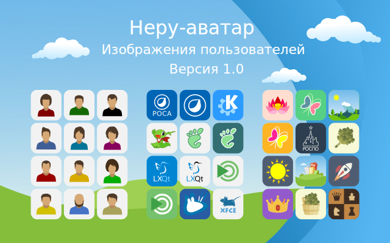

avatar-theme-neru
==================

Тема изображения пользователей. 

## Изображение 

## Особенности

* Подходит для разных окружений KDE4, KDE5, Xfce на других пока не проверялись

## Установка

Для KDE и XFCE
`git clone https://github.com/chistota/avatar-theme-neru.git /usr/share/mdk/faces`

`git clone https://github.com/chistota/avatar-theme-neru.git /usr/share/user-manager/avatars`

## Сообщество
РОСПО Дизайн-студия
https://vk.com/rospodesign
